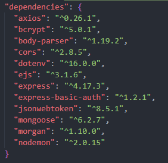
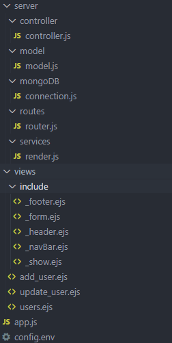

<h1>AdvDatabaseProject_CRUD</h1>
<table style="width:100%">
<tr><td style="width=30%">Author:</td><td>Alberto Orlando Mafla Prado</td></tr>
<tr><td>Student Number:</td><td>10147804</td></tr>
<tr><td>Module Title:</td><td>Advanced Database System</td></tr>
<tr><td>Module Code:</td><td>QHO541</td></tr>
<tr><td>Tutors Name:</td><td>Dr Ajmal Gharib</td></tr>
</table>

<table style="width:100%">
<tr><td style="width=30%">GitHub Repository</td><td><a href="https://github.com/A0M0305/AdvDatabaseProject_CRUD.git">A0M0305/AdvDatabaseProject_CRUD</a></td></tr>
</table>

<h2>Introduction</h2>
As part of my job as system administrator I have a responsibility of the daily management of our Cinema software “Vista”. As I administrate the different level of databases one of my struggles is the management of a rational database which requires separating the data. Which in term requires information to be stored in different areas of the program.
This can be time consuming as requires lots of opening, closing different windows to manage a user or item.

To solve this issue, I want to create a much simpler program that allows me to access and view all information as a User Management system minimising the closing of windows.
<h2>System Overview</h2>
<h3>Backend</h3>
<h4>Dependencies Tools</h4>

<ul>
<li>NodeJS</li>
<li>Express</li>
<li>mongoose - allows me to access my MongoBD</li>
<li>morgan - to help log messages when we request</li>
<li>Nodemon - Helps to restart the server when we make changes to the project (saves from pressing refresh)</li>
<li>ejs - the template engine I used to develop the project viua HTML and allows for JavaScript</li>
<li>body-parser - this allows us to serialise the data and access form data using body properties</li>
<li>dot env - this modules allows me to seperate the "secret" from the source code. This is for future development of the project where I can have other people collaborating with me but not sharing passcodes, just the code</li>
</ul>
<h4 align="center">Project Structure</h4>

Using the MVC (model, view, controller) pattern design. This helps separate the the application data and the business logic from the views (webpages). This is useful when needing to do updates/upgrades.
<ul>
<li>The controller mediates between the model and view</li>
<li>Model folder contains the MongoDB data. This will perform the data validation, process data, create mongo scheme</li>
<li>Controller folder will deal with the user request for resources from the server</li>
</ul>

#### How to run the project
- Type on terminal "npm start".
- This will kick start nodemon and you will have a link to the localhost page 5033.
- press ctrl and rightclick to open up the webpage
### Front End

## Key Design Decisions

## Database Design

## Security and Scalability

## Conclusions