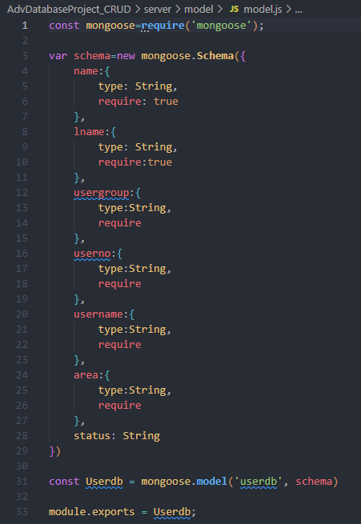
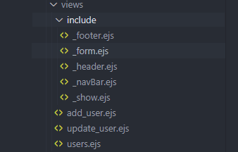
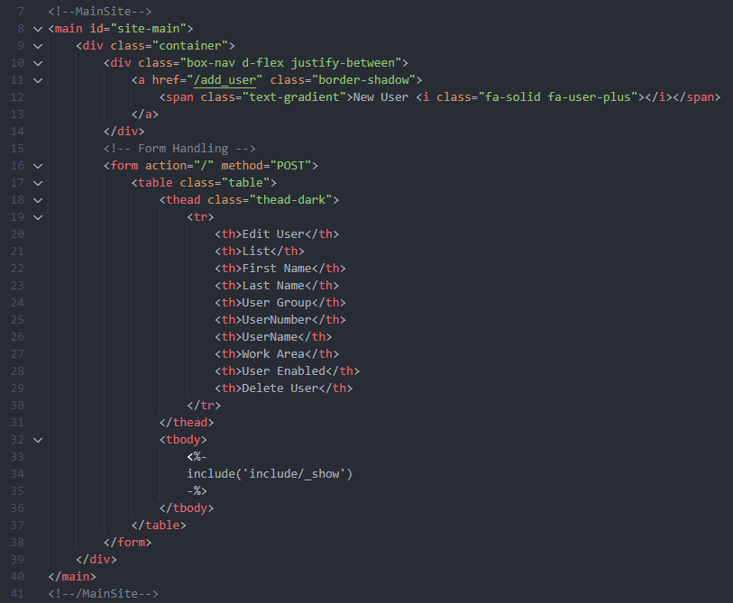
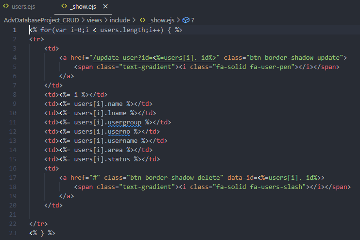
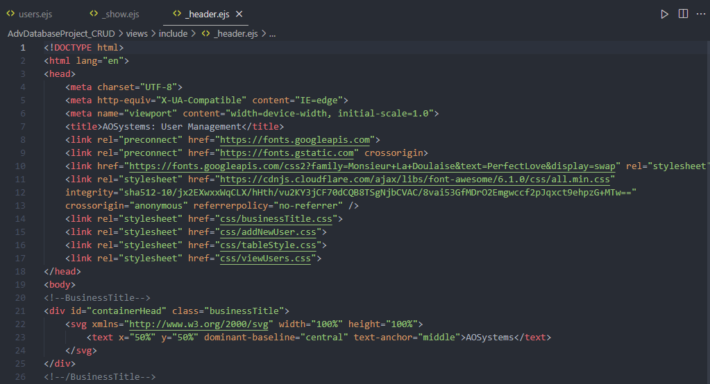
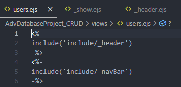
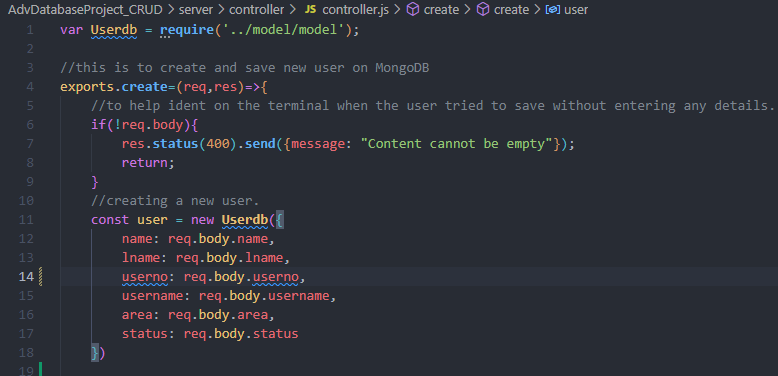

# Advanced CRUD Database Project
## Introduction
As part of my job as system administrator I have a responsibility of the daily management of our Cinema software “Vista”. As I administrate the different level of databases one of my struggles is the management of a rational database which requires separating the data. Which in term requires information to be stored in different areas of the program.
This can be time consuming as requires lots of opening, closing different windows to manage a user or item.

To solve this issue, I want to create a much simpler program that allows me to access and view all information as a User Management system minimizing the closing of windows.

## System Overview
### Backend
To support me with my assignment I required to installed a few dependencies to help achieve such tasks.

- NodeJS
- ejs
- Express
- Mongoose
- Morgan
- Nodemon
- Body-parse
- dot env

### Project Structure

#### Model - View - Controller Framework
Using the MVC structure we are able to separate the application into three logical components: the model, the view and the controller. These components are built to handle specific developments of the application. This structure is is frequently used as an industry-standard web development framework to create scalable projects.

##### Model
The model looks at the data, for this project MongoDB is the data storage client where we create, write, edit and delete to.

Connecting the the application is handled by the [`Controller`](####Controller). One of the reason as why MongoDB is a suitable application is due to the ability to connect directly as a host, through suitable providers. This format of availability is used via MongoDB Atlas. A more simple tool to use, where the UI is more friendlier to the eye is MongoDB Compass.

As this project is based of Atlas, to allow access to the database we require to adjust another security feature that MongoDB provides. Network Access. We this can be adjusted in the security/network section and can add that only specific IP Address can access. Suitable when working on a private project.

As we require access to this data from several. unknown, IP Address' we can set the ip to 0.0.0.0/0. As long as you have the admin and password to this database then its accessible from anywhere.

Following through the next step to connecting to MongoDB, from Visual Studios, is to write up the code. The dependencies that is required to access MongoDB is "Mongoose". Below you can see an image of this code where we have successfully connected to MongoDB.

One of the key aspects I always try to incorporate is the log in of information. Line 5 on the code just does that. Once we have successfully connected and found this db it will inform you on the terminal, and if it fails this will also acknowledge in line 8.

Looking at Line 4 of the code, you will see that we are directing this to an env file. Using a dotenv file is a form of security where you would store secret information that is for and stored on your computer. In this case this is where I would hold my private admin name and password for my eyes only.
If this was to be a group project, then each individual would require to have their own personal dotenv file due to the sensitivity. (Line 3)

With the MongoDB now connected, the thought process behind the data is how do I wish to present this data. As this plays a vital point for the model. As we will be creating, reading and updating this model. As well as MongoDB is a nonrelational type of database, which mean there are no tables and connectors involved between them like your standard database. the model for MongoDB is called a schema.

##### Views
Views is where we store what the user will see, the html files. Instead we are using ejs files as with ejs as with ejs its a simple tool that allows us to markup html format with Javascript to make it more usable or interactive.

The starting home page is the table list of all the staffing within the work area.

The primary requirement for the front page was the table design, nothing to complicated to structure out, follow up by the design to make the user interface more presentable and easier on the eye.

As the primary reason why we used ejs, I used javascript to pull in the data that we have stored in MongoDB. This can be seen in Lines 33 - 35.

One of the new methods I discovered during my research was how to manage and make my coding more cleaner and easier to manage. Rather than having a whole page of coding where finding a section I want to edit will make it more difficult, we can simplify the page and remove sections and display what we need.

If we look at where the javascript code is saved for Lines 33 - 35;

Has we have this code embedded into the main homepage, this would look a lot messier. Now we can read it clearly when we wish to change or edit.

Another useful use for this separation was separating the header. The header will always need to be available in every page you create for you application/website. The header alone can have a long lists of links, as per the image below.

Now we can create a new page with a simple javascript header code. And review the code above on a separate area. Any editing of this header page will automatically be updating every page connected, rather than manually adapting them one by one.

##### Controller

Finally we look at how all this is managed by the controller. The controller is responsible for processing incoming requests, performing the operation of the model. So in my system the controller deals with my whole CRUD application.#

To start the controller requires to bring forward the model that we are using from the model folder

