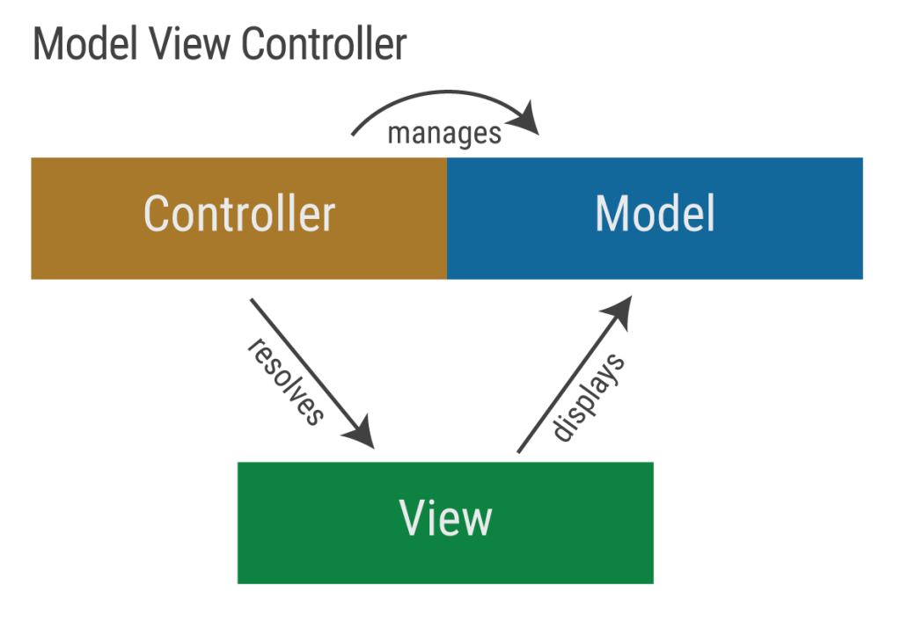
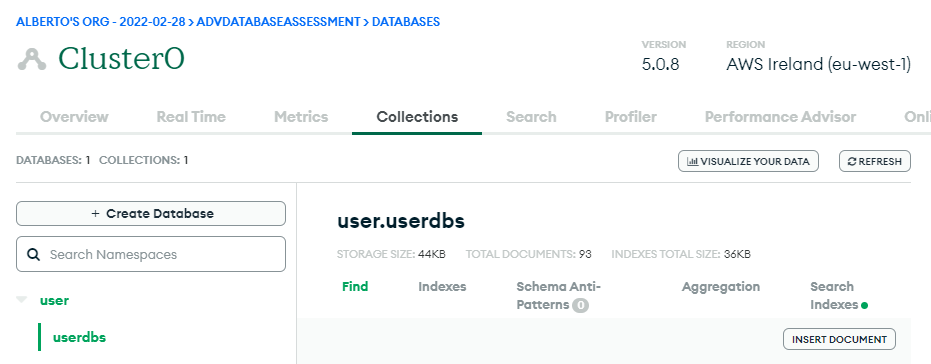
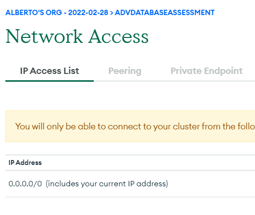
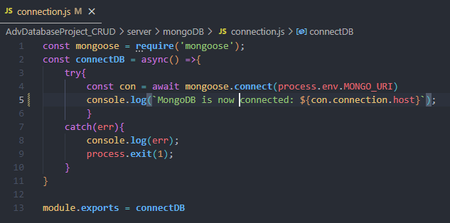
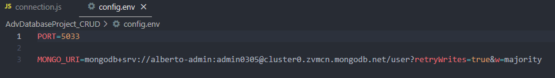

# Advanced CRUD Database Project
## Introduction
As part of my job as system administrator I have a responsibility of the daily management of our Cinema software “Vista”. As I administrate the different level of databases one of my struggles is the management of a rational database which requires separating the data. Which in term requires information to be stored in different areas of the program.
This can be time consuming as requires lots of opening, closing different windows to manage a user or item.

To solve this issue, I want to create a much simpler program that allows me to access and view all information as a User Management system minimizing the closing of windows.

## System Overview
### Backend
To support me with my assignment I required to installed a few dependencies to help achieve such tasks.

- NodeJS
- ejs
- Express
- Mongoose
- Morgan
- Nodemon
- Body-parse
- dot env

### Project Structure
#### Model - View - Controller Framework
Using the MVC structure we are able to separate the application into three logical components: the model, the view and the controller. These components are built to handle specific developments of the application. This structure is is frequently used as an industry-standard web development framework to create scalable projects.

##### Model
The model looks at the data, for this project MongoDB is the data storage client where we create, write, edit and delete to.

Connecting the the application is handled by the ['Controller'](#####Controller). One of the reason as why MongoDB is a suitable application is due to the ability to connect directly as a host, through suitable providers. This format of availability is used via MongoDB Atlas. A more simple tool to use, where the UI is more friendlier to the eye is MongoDB Compass.

As this project is based of Atlas, to allow access to the database we require to adjust another security feature that MongoDB provides. Network Access. We this can be adjusted in the security/network section and can add that only specific IP Address can access. Suitable when working on a private project.

As we require access to this data from several. unknown, IP Address' we can set the ip to 0.0.0.0/0. As long as you have the admin and password to this database then its accessible from anywhere.

Following through the next step to connecting to MongoDB, from Visual Studios, is to write up the code. The dependencies that is required to access MongoDB is "Mongoose". Below you can see an image of this code where we have successfully connected to MongoDB.

One of the key aspects I always try to incorporate is the log in of information. Line 5 on the code just does that. Once we have successfully connected and found this db it will inform you on the terminal, and if it fails this will also acknowledge in line 8.

Looking at Line 4 of the code, you will see that we are directing this to an env file. Using a dotenv file is a form of security where you would store secret information that is for and stored on your computer. In this case this is where I would hold my private admin name and password for my eyes only.
If this was to be a group project, then each individual would require to have their own personal dotenv file due to the sensitivity. (Line 3)

##### Views

##### Controller